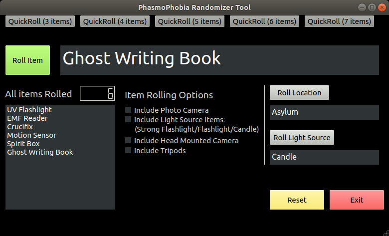

```
______ _                                     _           _     _       
| ___ \ |                                   | |         | |   (_)      
| |_/ / |__   __ _ ___ _ __ ___   ___  _ __ | |__   ___ | |__  _  __ _ 
|  __/| '_ \ / _` / __| '_ ` _ \ / _ \| '_ \| '_ \ / _ \| '_ \| |/ _` |
| |   | | | | (_| \__ \ | | | | | (_) | |_) | | | | (_) | |_) | | (_| |
\_|   |_| |_|\__,_|___/_| |_| |_|\___/| .__/|_| |_|\___/|_.__/|_|\__,_|
                                      | |                              
                                      |_|                              
______                _                 _                              
| ___ \              | |               (_)                             
| |_/ /__ _ _ __   __| | ___  _ __ ___  _ _______ _ __                 
|    // _` | '_ \ / _` |/ _ \| '_ ` _ \| |_  / _ \ '__|                
| |\ \ (_| | | | | (_| | (_) | | | | | | |/ /  __/ |                   
\_| \_\__,_|_| |_|\__,_|\___/|_| |_| |_|_/___\___|_|                   
                                                                       
```                                                                                                                                                               
Application for randomizing player items, map, and light sources in the game Phasmophobia.
Tested to work with both Windows and Linux (has not been tested on macOS yet).

Linux Preview:



For use with the Unix Terminal Or Microsoft Windows Command Prompt.

## Setup
- Requires Python 3 (any version 3.x.x will work)
- Requires PyQt5 which can be installed by opening the Windows Command Prompt or Linux terminal and typing:
> pip install pyqt5

## How to run
- Extract PhasmoPhobiaRandomizer-main.zip
- Open Windows Command Prompt or the Linux Terminal and start the program with:
> python3 phasmoApp.py
