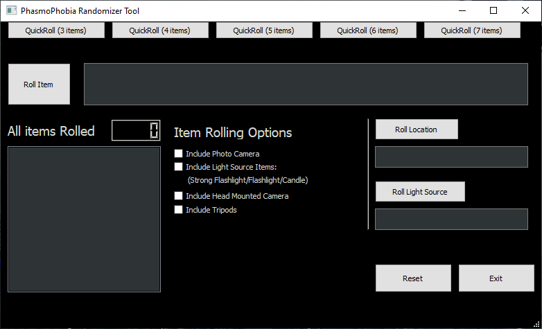

```

██████╗░██╗░░██╗░█████╗░░██████╗███╗░░░███╗░█████╗░██████╗░██╗░░██╗░█████╗░██████╗░██╗░█████╗░
██╔══██╗██║░░██║██╔══██╗██╔════╝████╗░████║██╔══██╗██╔══██╗██║░░██║██╔══██╗██╔══██╗██║██╔══██╗
██████╔╝███████║███████║╚█████╗░██╔████╔██║██║░░██║██████╔╝███████║██║░░██║██████╦╝██║███████║
██╔═══╝░██╔══██║██╔══██║░╚═══██╗██║╚██╔╝██║██║░░██║██╔═══╝░██╔══██║██║░░██║██╔══██╗██║██╔══██║
██║░░░░░██║░░██║██║░░██║██████╔╝██║░╚═╝░██║╚█████╔╝██║░░░░░██║░░██║╚█████╔╝██████╦╝██║██║░░██║
╚═╝░░░░░╚═╝░░╚═╝╚═╝░░╚═╝╚═════╝░╚═╝░░░░░╚═╝░╚════╝░╚═╝░░░░░╚═╝░░╚═╝░╚════╝░╚═════╝░╚═╝╚═╝░░╚═╝

██████╗░░█████╗░███╗░░██╗██████╗░░█████╗░███╗░░░███╗██╗███████╗███████╗██████╗░
██╔══██╗██╔══██╗████╗░██║██╔══██╗██╔══██╗████╗░████║██║╚════██║██╔════╝██╔══██╗
██████╔╝███████║██╔██╗██║██║░░██║██║░░██║██╔████╔██║██║░░███╔═╝█████╗░░██████╔╝
██╔══██╗██╔══██║██║╚████║██║░░██║██║░░██║██║╚██╔╝██║██║██╔══╝░░██╔══╝░░██╔══██╗
██║░░██║██║░░██║██║░╚███║██████╔╝╚█████╔╝██║░╚═╝░██║██║███████╗███████╗██║░░██║
╚═╝░░╚═╝╚═╝░░╚═╝╚═╝░░╚══╝╚═════╝░░╚════╝░╚═╝░░░░░╚═╝╚═╝╚══════╝╚══════╝╚═╝░░╚═╝             
                                                                       
```                                                                                                                                                               
Application for randomizing player items, map, and light sources in the game Phasmophobia.
Tested to work with both Windows and Linux (has not been tested on macOS yet).

## Windows Preview:



## Linux Preview:


For use with the Unix Terminal Or Microsoft Windows Command Prompt.

## Setup
- Requires Python 3 (any version 3.x.x will work)
- Requires PyQt5 which can be installed by opening the Windows Command Prompt or Linux terminal and typing:
> pip install pyqt5

# How to run
## Windows
- Extract PhasmoPhobiaRandomizer-main.zip
- Double click Run.bat to start the program.

## Linux
- Extract PhasmoPhobiaRandomizer-main.zip
- Open Linux Terminal and start the program with:
> python3 phasmoApp.py
