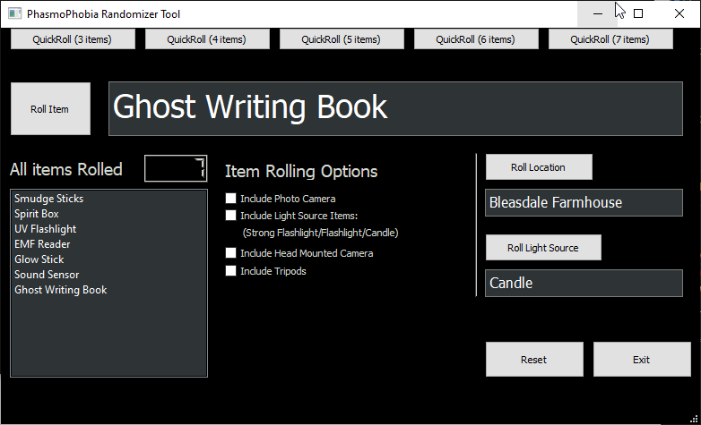

# Phasmophobia Randomizer                                                                       

Application for randomizing player items, map, and light sources in the game Phasmophobia.
Working versions for both Windows and Linux (GUI has not been tested on macOS yet).

## Windows Preview:

## Linux Preview:

For use with the Unix Terminal Or Microsoft Windows Command Prompt.

## Setup
- Requires Python 3 (any version 3.x.x will work)
- Requires PyQt5 which can be installed by opening the Windows Command Prompt or Linux terminal and typing:
> pip install pyqt5

# How to run
## Windows
- Extract PhasmoPhobiaRandomizer-main.zip
- Double click Run.bat to start the program.

## Linux
- Extract PhasmoPhobiaRandomizer-main.zip
- Start the program by navigating to the PhasmophobiaRandomizer-1.0x folder in the terminal and typing:
> python3 phasmoApp.py

### Also note:
- Using the exit button on the bottom right corner has the same functionality as hitting the X built into your window in the top corner and either will close the program without any issues.
